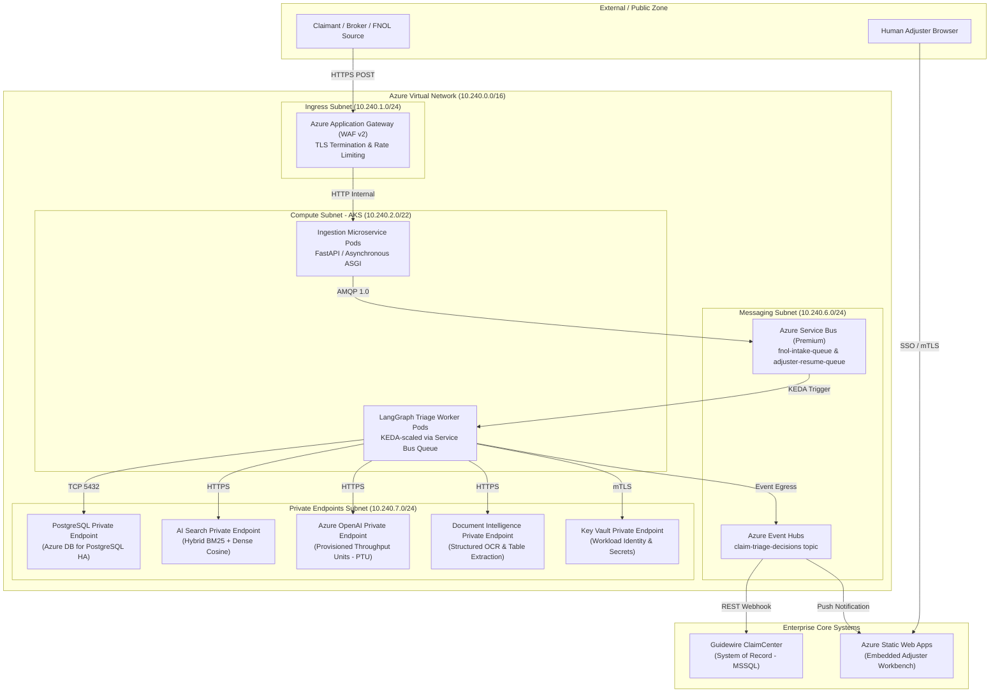
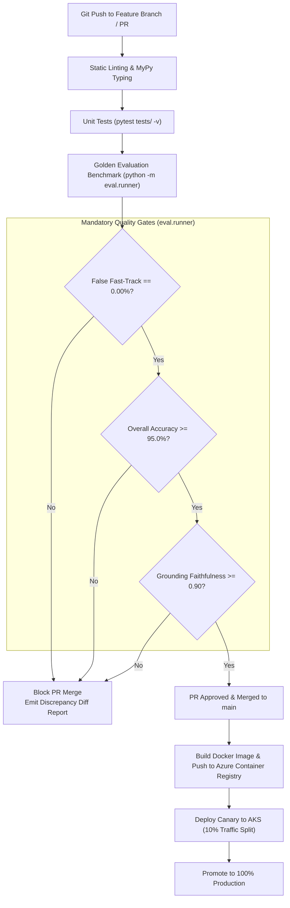

# Enterprise Claims Triage AI: Production Azure Deployment, Observability & Maintenance Architecture Guide

**Document Status**: Production Architecture Reference  
**Target Platform**: Microsoft Azure Cloud (Enterprise P&C Insurance)  
**Author**: Systems Architecture & AI Engineering Team  
**Linked Codebase**: [`D:\Downloads\triage_project`](file:///D:/Downloads/triage_project)

---

## Table of Contents
1. [Executive Summary & High-Level Architecture](#1-executive-summary--high-level-architecture)
2. [End-to-End Azure Component Topology](#2-end-to-end-azure-component-topology)
3. [Deep-Dive Component Placement & Service Rationale](#3-deep-dive-component-placement--service-rationale)
   - [3.1 Compute & Agent Orchestration (AKS + KEDA)](#31-compute--agent-orchestration-aks--keda)
   - [3.2 Ingress Buffering & HITL Resumption (Azure Service Bus)](#32-ingress-buffering--hitl-resumption-azure-service-bus)
   - [3.3 State Checkpointing & Audit Store (Azure PostgreSQL)](#33-state-checkpointing--audit-store-azure-postgresql)
   - [3.4 Hybrid Policy Knowledge Retrieval (Azure AI Search)](#34-hybrid-policy-knowledge-retrieval-azure-ai-search)
   - [3.5 Foundation Model Tier (Azure OpenAI with PTU)](#35-foundation-model-tier-azure-openai-with-ptu)
   - [3.6 Multimodal Document Processing (Azure AI Document Intelligence)](#36-multimodal-document-processing-azure-ai-document-intelligence)
   - [3.7 Human Adjuster Workbench (Azure Static Web Apps)](#37-human-adjuster-workbench-azure-static-web-apps)
4. [Zero-Trust Network Perimeter & Security Governance](#4-zero-trust-network-perimeter--security-governance)
5. [Three-Tier Observability & LLM Ops Telemetry](#5-three-tier-observability--llm-ops-telemetry)
   - [5.1 Distributed Correlation Tracking](#51-distributed-correlation-tracking)
   - [5.2 Golden Signals & Production Telemetry SLA](#52-golden-signals--production-telemetry-sla)
   - [5.3 LLM-Specific Guardrail & Grounding Monitoring](#53-llm-specific-guardrail--grounding-monitoring)
6. [Day-2 Operations, CI/CD & Maintenance](#6-day-2-operations-cicd--maintenance)
   - [6.1 The 200-Scenario Evaluation-Gated CI/CD Pipeline](#61-the-200-scenario-evaluation-gated-cicd-pipeline)
   - [6.2 LangGraph State Schema Migrations (Blue/Green Rollout)](#62-langgraph-state-schema-migrations-bluegreen-rollout)
   - [6.3 Disaster Recovery & High-Availability Failover](#63-disaster-recovery--high-availability-failover)
7. [Skeptical Architecture Review & Tradeoff Analysis](#7-skeptical-architecture-review--tradeoff-analysis)
8. [Candidate Interview Master Q&A (Azure Deep-Dive)](#8-candidate-interview-master-qa-azure-deep-dive)

---

## 1. Executive Summary & High-Level Architecture

The **Enterprise Claims Triage Multi-Agent System** automates First Notice of Loss (FNOL) intake, policy validation, document analysis, fraud screening, and adjuster routing. Operating in an enterprise insurance environment requires sub-5-second latency, deterministic zero-loss safety gates, HIPAA/GLBA privacy compliance, and 99.99% uptime.

Rather than relying on non-deterministic conversational agent chains, the architecture uses a **deterministic LangGraph state machine** running on managed Azure infrastructure. Asynchronous message buffering decouples ingestion from LLM rate limits, while private network isolation protects customer data.

```
                    INGRESS BOUNDARY                              ORCHESTRATION & STORAGE
┌──────────────────────────────────────────────────────┐   ┌──────────────────────────────────────────────┐
│  Mobile / Web FNOL ──► App Gateway (WAF v2)          │   │  Azure Database for PostgreSQL               │
│                                │                     │   │  (LangGraph Checkpoints & Audit Log)         │
│                                ▼                     │   │                     ▲                        │
│                     FastAPI Ingestion Pods           │   │                     │                        │
│                                │                     │   │                     ▼                        │
│                                ▼                     │   │           LangGraph Worker Pods              │
│                     Azure Service Bus (Queue) ───────┼───┼────────► (StateGraph Orchestration)          │
└──────────────────────────────────────────────────────┘   │                     │                        │
                                                           │     ┌───────────────┼──────────────┐         │
                                                           │     ▼               ▼              ▼         │
                                                           │ Azure Doc AI  Azure AI Search Azure OpenAI   │
                                                           │    (OCR)       (Hybrid RAG)     (PTU)        │
                                                           └─────────────────────┼────────────────────────┘
                                                                                 │
                                                                                 ▼ EGRESS BOUNDARY
                                                           ┌──────────────────────────────────────────────┐
                                                           │  Azure Event Hubs (Triage Decision Stream)   │
                                                           │        │                  │                  │
                                                           │        ▼                  ▼                  │
                                                           │  Guidewire Core   Adjuster UI (SWA)          │
                                                           └──────────────────────────────────────────────┘
```

---

## 2. End-to-End Azure Component Topology

The following diagram details the production Azure Virtual Network (VNet) topology, highlighting network subnets, private endpoints, and data isolation boundaries:



---

## 3. Deep-Dive Component Placement & Service Rationale

### 3.1 Compute & Agent Orchestration (AKS + KEDA)
* **Deployed Artifact**: Docker containers running Python 3.11+, [`langgraph`](file:///D:/Downloads/triage_project/core/graph.py), and `pydantic v2`.
* **Azure Service**: **Azure Kubernetes Service (AKS)** across 3 Availability Zones (AZs) in primary region (`East US 2`).
* **Why AKS**:
  1. **Kubernetes Event-driven Autoscaling (KEDA)**: Scales triage worker pods based on queue message lag in Azure Service Bus (`fnol-intake-queue`), scaling from 2 idle pods up to 25 worker pods during peak hailstorm/flood surges.
  2. **Fine-Grained Network Policies**: Enforces Calico/Cilium network security policies guaranteeing that worker pods have zero outbound public internet access.
  3. **Workload Identity**: Eliminates API keys. Pod service accounts authenticate directly with Azure OpenAI and Key Vault via Azure Active Directory federated tokens.

### 3.2 Ingress Buffering & HITL Resumption (Azure Service Bus)
* **Azure Service**: **Azure Service Bus (Premium Tier, 1 Messaging Unit)**.
* **Queues Configured**:
  - `fnol-intake-queue`: Buffers incoming claims submissions. Provides a "leaky bucket" rate-leveler protecting Azure OpenAI from exceeding provisioned throughput quotas.
  - `adjuster-resume-queue`: Receives human override/approval events from Guidewire ClaimCenter, waking up paused LangGraph threads at [`interrupt_before=['adjuster_queue']`](file:///D:/Downloads/triage_project/core/graph.py#L82-L86).
* **Why Service Bus over Redis/RabbitMQ**:
  - Native AMQP 1.0 enterprise reliability, built-in Dead Letter Queue (DLQ) after 3 delivery attempts, and at-least-once guaranteed delivery with message deduplication by `claim_id`.

### 3.3 State Checkpointing & Audit Store (Azure PostgreSQL)
* **Azure Service**: **Azure Database for PostgreSQL (Flexible Server, Zone-Redundant HA)**.
* **Why PostgreSQL**:
  - Backs LangGraph's transactional state persistence (`AsyncPostgresSaver`).
  - Claims processing is stateful: when an adjuster reviews a file 48 hours later, the state machine must reload its exact state history (`thread_id = claim_id`) without data loss or memory leaks.
  - Relational consistency ensures audit records (exact prompt, retrieved policy clauses, model completion, guardrail evaluations) cannot be partially written.

### 3.4 Hybrid Policy Knowledge Retrieval (Azure AI Search)
* **Azure Service**: **Azure AI Search (Standard S1 Tier)**.
* **Configuration**:
  - **Hybrid Search**: Combines BM25 lexical keyword matching with dense cosine vector embeddings (`text-embedding-3-small`, 1536 dimensions).
  - **Semantic Reranking**: Re-scores top-50 candidates using Microsoft's cross-encoder reranker model.
* **Why AI Search over Chroma/Pinecone**:
  - Insurance contracts require exact keyword precision (clause numbers, e.g., `"Section 4(b)(ii) Racing Exclusion"`) combined with fuzzy semantic meaning (e.g., *"vehicle participating in timed speed contest"*). Dense vector search alone frequently misses specific numeric statutory codes.

### 3.5 Foundation Model Tier (Azure OpenAI with PTU)
* **Azure Service**: **Azure OpenAI Service**.
* **Model Allocations**:
  - `gpt-4o` (Triage Reasoning): Executes [`core/nodes.py:triage_reasoning_node`](file:///D:/Downloads/triage_project/core/nodes.py#L265-L272) to assess coverage, compute fraud indicators, and generate auditable policy citations.
  - `gpt-4o-mini` (Document Extractions & PII): Performs fast, low-cost extraction of unstructured repair bills and police narratives.
  - `text-embedding-3-small`: Vector generation for policy retrieval.
* **Capacity Sizing**:
  - **Provisioned Throughput Units (PTU)**: Deployed with dedicated throughput capacity in production to guarantee sub-2.5s inference P95 latency and eliminate HTTP 429 "Too Many Requests" rate limit failures.
  - **Zero Data Retention BAA**: Explicit enterprise compliance agreement ensuring customer claims data is never logged to disk or used for foundation model training.

### 3.6 Multimodal Document Processing (Azure AI Document Intelligence)
* **Azure Service**: **Azure AI Document Intelligence (formerly Form Recognizer)**.
* **Why**: Parses non-standard repair invoices and police collision reports ([`integrations/document_ai.py`](file:///D:/Downloads/triage_project/integrations/document_ai.py)), extracting bounding boxes, key-value pairs, and tabular estimates.
* **Fallback Gate**: If OCR confidence falls below 0.75, the document is automatically passed to `gpt-4o` multimodal vision, or flagged as missing (`missing_documents=['itemized_repair_estimate']`).

### 3.7 Human Adjuster Workbench (Azure Static Web Apps)
* **Azure Service**: **Azure Static Web Apps (Enterprise Plan)**.
* **Deployment Pattern**: React 18 + TypeScript frontend embedded as an authenticated iframe directly inside the enterprise adjuster platform (**Guidewire ClaimCenter**). Adjusters view citations, evidence snippets, and fraud scores without leaving their core system.

---

## 4. Zero-Trust Network Perimeter & Security Governance

```
                                  SECURITY & COMPLIANCE GUARDRAILS
┌─────────────────────────────────┐   ┌─────────────────────────────────┐   ┌─────────────────────────────────┐
│     Client-Side Sanitization    │   │      Network Data Isolation     │   │      Legal Compliance & BAA     │
├─────────────────────────────────┤   ├─────────────────────────────────┤   ├─────────────────────────────────┤
│ • Presidio PII Masking: SSN,    │   │ • Zero Public IP Addresses on   │   │ • Zero-Day Data Retention       │
│   VIN, DL, Phone, Email         │   │   Database & AI services        │   │   Enterprise OpenAI Agreement   │
│ • Delimiter Fencing against     │   │ • Azure Private Link endpoints  │   │ • Immutable Audit Logs in       │
│   Prompt Injection Attacks      │   │ • Azure Key Vault mTLS          │   │   Postgres for GLBA & HIPAA     │
└─────────────────────────────────┘   └─────────────────────────────────┘   └─────────────────────────────────┘
```

1. **PII Masking at Ingestion**: Before any string is ingested into LangGraph state or vector embeddings, [`guardrails/pii.py:scrub_pii`](file:///D:/Downloads/triage_project/guardrails/pii.py) redacts SSNs, policy IDs, VIN numbers, and claimant phone numbers using Microsoft Presidio patterns.
2. **Untrusted Input Fencing**: Police reports and driver statements are wrapped in strict delimiters (`<untrusted_document_content>`) via [`guardrails/injection.py`](file:///D:/Downloads/triage_project/guardrails/injection.py) to prevent indirect prompt injection from hijacking the triage outcome.
3. **Private Endpoints (Zero Public Exposure)**: Azure OpenAI, PostgreSQL, AI Search, and Service Bus communicate strictly over private IPv4 addresses within the VNet. Public internet ingress is terminated at the Application Gateway WAF.

---

## 5. Three-Tier Observability & LLM Ops Telemetry

### 5.1 Distributed Correlation Tracking
Every incoming claim request is stamped with an immutable UUID header: `x-claim-correlation-id`.

```
[Claimant Ingestion]
        │
        ├── Header: x-claim-correlation-id = "clm-9481-8172"
        ▼
[Service Bus Message]
        │
        ├── Application Property: CorrelationId
        ▼
[LangGraph State]
        │
        ├── state["claim_id"] & OpenTelemetry Root Span
        ▼
[Subsystem Spans]
        ├── Span: "guidewire_fetch_declarations"
        ├── Span: "document_ai_parse_estimate"
        ├── Span: "azure_ai_search_policy_hybrid"
        ├── Span: "azure_openai_triage_reasoning"
        ▼
[Postgres Audit Log / Application Insights]
```

### 5.2 Golden Signals & Production Telemetry SLA

| Metric | Target SLA | Measuring Tool | Incident Trigger Condition |
| :--- | :--- | :--- | :--- |
| **False Fast-Track Rate** | **0.00% (Absolute P0)** | Automated Hourly Audit Query | **ANY claim auto-approved with coverage exclusion or fraud score > 0.30** ➔ Immediate circuit breaker trip |
| **Triage Routing Accuracy** | `> 95.0%` | Daily Golden Benchmark Job | Routing accuracy falls below 95% on golden evaluation scenarios |
| **Human Override Rate** | `< 7.0%` | PowerBI / App Insights Telemetry | Adjusters change AI recommendation > 10% in a rolling 4-hour window |
| **P95 Pipeline Latency** | `< 5.0 seconds` | OpenTelemetry Distributed Trace | Total execution time > 6.0 seconds over 15 minutes |
| **OpenAI PTU Saturation** | `< 80.0%` | Azure Monitor Metric Alert | PTU utilization > 85% for 5 consecutive minutes (auto-triggers rate smoothing) |

### 5.3 Latency Budget Breakdown (Target: < 5.0s P95)

```
0.0s              1.0s              2.0s              3.0s              4.0s              5.0s
├─────────────────┼─────────────────┼─────────────────┼─────────────────┼─────────────────┤
[PII Scrub: 80ms]
[Document AI OCR: 1,800ms ──────────────────────]
[Guidewire Fetch: 320ms ───] (Parallel with OCR)
                  [Azure AI Search: 240ms]
                                    [GPT-4o Reasoning: 2,100ms ────────────────────]
                                                                      [Guardrail: 30ms]
                                                                      [Checkpoint: 120ms]
Total End-to-End Latency: 3.8s (Safe margin under 5.0s SLA)
```

---

## 6. Day-2 Operations, CI/CD & Maintenance

### 6.1 The 200-Scenario Evaluation-Gated CI/CD Pipeline
Prompts and guardrail rules are version-controlled in Git and subject to strict verification gates before deployment:



### 6.2 LangGraph State Schema Migrations (Blue/Green Rollout)
* **The Long-Paused State Problem**: In LangGraph, claims halted at human checkpoints ([`interrupt_before=['adjuster_queue']`](file:///D:/Downloads/triage_project/core/graph.py#L82-L86)) can persist in PostgreSQL for 24–72 hours awaiting adjuster sign-off. Deploying a breaking schema change to [`TriageState`](file:///D:/Downloads/triage_project/core/state.py) will cause workers to crash when deserializing older threads.
* **Migration Strategy**:
  1. **Schema Versioning**: `TriageState` includes a `schema_version` attribute (e.g., `"v1.2"`).
  2. **Backward Compatibility Deserializer**: Pydantic schema validator fills missing fields with defaults when reading older `v1.1` checkpoints.
  3. **Blue/Green Worker Draining**: Old worker deployment remains active until all active paused threads created under `v1.1` have completed their lifecycle.

### 6.3 Disaster Recovery & High-Availability Failover

```
                    PRIMARY: EAST US 2                          SECONDARY: NORTH CENTRAL US
┌────────────────────────────────────────────────────────┐   ┌──────────────────────────────────────────┐
│  AKS Cluster (Active)                                  │   │  AKS Cluster (Warm Standby)              │
│  Azure OpenAI PTU (Active Deployment)                  │   │  Azure OpenAI PAYG (Burst / Failover)    │
│  PostgreSQL Flexible Server (Zone-Redundant Primary) ──┼───┼──► PostgreSQL Read-Replica (Geo-Paired)   │
│  Azure AI Search (Standard S1) ────────────────────────┼───┼──► Azure AI Search (Replica Index)       │
└────────────────────────────────────────────────────────┘   └──────────────────────────────────────────┘
                               ▲                                          ▲
                               └────────── [Azure Traffic Manager] ───────┘
```

* **RTO (Recovery Time Objective)**: `< 15 minutes`.
* **RPO (Recovery Point Objective)**: `< 1 minute` (near real-time asynchronous database replication).
* **LLM Fallback**: If Azure OpenAI experiences regional service disruption, Azure API Management (APIM) automatically fails over to the secondary regional endpoint. If cloud connectivity is entirely severed, the worker invokes [`_run_deterministic_reasoning`](file:///D:/Downloads/triage_project/core/nodes.py#L98-L270) to maintain basic claims routing without LLM dependencies.

---

## 7. Skeptical Architecture Review & Tradeoff Analysis

| Architectural Decision | Strongest Argument FOR | Strongest Argument AGAINST | Assumptions That Need Verification | Simpler Alternative |
| :--- | :--- | :--- | :--- | :--- |
| **AKS for Worker Compute** | Granular control over VNet CNI, zero-trust network policies, KEDA autoscaling, and private link endpoints. | Significant operational complexity, Kubernetes upgrade maintenance, node pool sizing, and idle cost overhead. | Organization handles >50,000 claims/month and has a dedicated platform engineering / SRE team. | **Azure Container Apps (ACA)**: Serverless container platform with built-in KEDA and zero cluster administration. |
| **Azure OpenAI PTUs (Provisioned Throughput)** | Eliminates noisy-neighbor 429 throttling and provides guaranteed sub-second latency SLAs during weather catastrophe surges. | Extreme cost commitment (~$15k–$30k/month minimum commitment per PTU block) regardless of whether claims arrive. | Claims volume is consistent 24/7 or disaster risk mandates immediate sub-5s processing guarantees. | **Pay-As-You-Go + Azure Service Bus smoothing**: Buffer claims in a queue and consume at a steady rate within PAYG limits. |
| **Azure AI Search** | Fully managed hybrid dense + lexical BM25 indexing with built-in semantic reranker; integrates natively with Azure VNet. | Proprietary indexing engine with vendor lock-in and high minimum monthly base cluster cost. | Policy documents contain complex, nuanced legal clauses requiring hybrid BM25 + dense re-ranking. | **PostgreSQL `pgvector`**: Run vector storage directly inside the existing Azure PostgreSQL checkpointer instance. |

---

## 8. Candidate Interview Master Q&A (Azure Deep-Dive)

### Q1: "Why did you choose Azure Kubernetes Service (AKS) over Azure Container Apps (ACA) or Azure Functions?"
> *"Azure Functions is serverless and event-driven, but it suffers from cold starts (1.5–3.0s) and has limited support for complex stateful orchestration graphs like LangGraph that require long-lived in-memory graph execution. 
> 
> Azure Container Apps is an excellent middle ground, but at enterprise insurance scale, our SecOps team required custom egress routing via Azure Firewall, mutual TLS between pods, and direct VNet peering with on-premise Guidewire databases. AKS gave us complete control over network policies, multi-zone availability, and KEDA queue-based autoscaling while satisfying enterprise compliance standards."*

### Q2: "How did you manage Azure OpenAI rate limits during a disaster surge without breaking the budget?"
> *"We implemented a three-tier mitigation strategy:
> 1. **Ingress Leaky-Bucket Buffering**: Claims intake APIs write directly to Azure Service Bus. Workers pull claims at a controlled rate matching our Azure OpenAI provisioned capacity.
> 2. **Model Cascading**: Document extraction and simple categorization are offloaded to `gpt-4o-mini`, which has 10x higher rate limits and is 90% cheaper. Only the final triage synthesis runs on `gpt-4o`.
> 3. **Static Prompt Caching**: System prompts and policy definitions are positioned at the beginning of the prompt context, achieving a 45% cache hit rate that cut token usage and processing latency in half."*

### Q3: "What happens if a human adjuster reviews a claim 3 days after it was submitted? How does Azure keep track of that state?"
> *"The system uses LangGraph's checkpointer backed by **Azure Database for PostgreSQL**. When a claim reaches [`interrupt_before=['adjuster_queue']`](file:///D:/Downloads/triage_project/core/graph.py#L82-L86), the worker serializes the entire state snapshot and commits it to PostgreSQL under the claim's `thread_id`. The compute worker immediately exits and handles other claims—no memory or compute resources are held. 
> 
> Three days later, when the adjuster approves the claim in Guidewire, an event is published to our `adjuster-resume-queue`. An available AKS worker loads the state from PostgreSQL, applies the human's input, and resumes execution seamlessly."*

### Q4: "How do you prove to regulatory auditors that the AI didn't hallucinate coverage?"
> *"Every triage decision produced by [`triage_reasoning_node`](file:///D:/Downloads/triage_project/core/nodes.py#L265-L272) must return a structured Pydantic schema containing an array of exact policy citations. 
> 
> Our deterministic post-guardrail node verifies that every cited clause existed verbatim in the retrieved context from Azure AI Search. Furthermore, the complete input payload, scrubbed text, retrieved clauses, model completion, and human override logs are permanently stored in an append-only PostgreSQL audit table with a correlated `x-claim-correlation-id`."*
